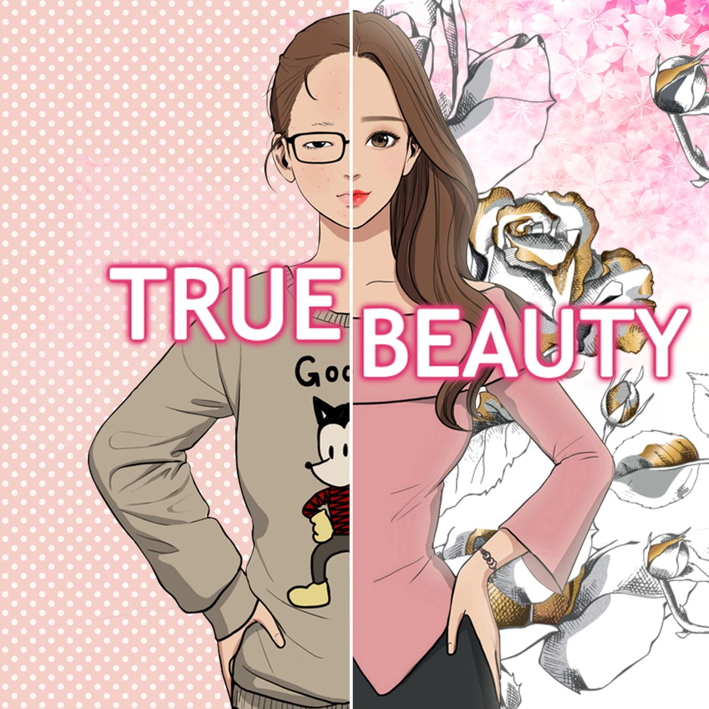
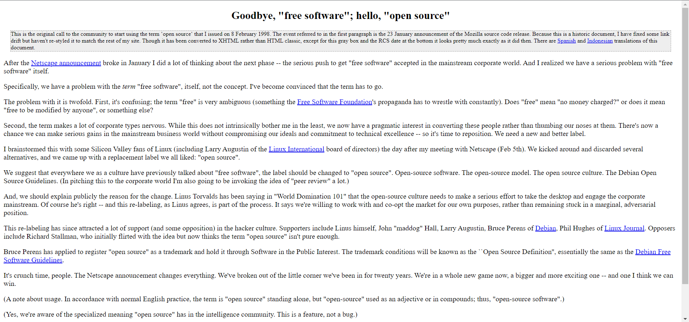

## True Beauty

My current obsession is a Webtoon story called "True Beauty" which follows a young girl, Jugyeong, and her high school and college adventures while living a double life. The story begins with her being bullied in middle school for being ugly, and not fitting the typical Korean beauty standard and liking feminine things. She decides to take action against this and begin to wear makeup to cover up her real face, purchase better clothes, and hide her true interests in horror movies and novels. Without getting too into the details of the story, I found this very relatable to creating nice looking web pages. And as terrible as this sounds, looks do matter in terms of using UI Frameworks for web applications and for our protagonist Jugyeong. Without the wow aspect of using makeup, wearing more feminine clothing, and overall being more "girly", Jugyeong wouldn't have been able to be: popular, appear more attractive, and be as well known as she had been in the show. Same concept with websites, the uglier a website looks the less likely a user is going to use it. Because despite the content of the website, a user might as well look for a different site to use because if they're going to be looking at it for an extended period of time then it'd be easier on the eyes if it were organized and nice to look at. 

## Raw HTML vs UI Frameworks
As the title "True Beauty" stands, the story dives into the topic of the beauty within a person. Prior to the makeover Jugyeong has a relateable and bubbly personality which she consistently has throughout the story, with the only difference being her external appearance. Relating these to a website's anatomy, her personality would be the HTML or content of a website and changing her physical appearance would be the difference between using UI Frameworks or CSS for styling and not using any at all.

## Before and After Styling

A real life example of this using websites that have similar content, covering open source software, but with very different styling.

  

    

        
        <a href="https://www.synopsys.com/glossary/what-is-open-source-software.html">website using a UI Framework</a>
    

  

  

    

      
      <a href="http://catb.org/~esr/open-source.html">website with raw HTML</a>
    

  

