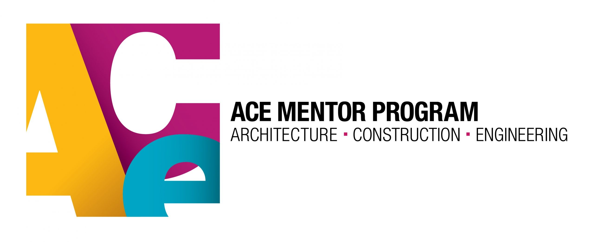

# ACE Design Competition

The Architecture Construction and Engineering (ACE) Design Competition was held two years ago in Washington D.C. where my team and I were one of the three teams selected on a natioal scale to compete for the national title. I participated in this group project as part of an extracurricular challenge by my engineering teacher at the time who administrated the preliminary ideas through her classroom curriculum. The basis of this competition cosisted of three different challenges: a playgroud, urban transportation system, and community health clinic. My group and I participated in the community health clinic category and won first for our state. 

The requirements for this competition is to have a computer aided model of the design, a detailed board to present to a panel of judges, as well as strict explanations for the desired budget, location zoning, and use of sustainable materials. Of these tasks I was responsible for delegating the work for different parts of the presentation board, researching the materials and zoning of the clinic's location, and creating the presentation speech. While I was not responsible for the computer aided modeling, since we only had one device to work with at the time, I was able to provide input on certain building aspects such as the dimensions and terrain the clinic would be sitting on. The main technical skills that I obtained from this experience are: Computer Aided Modeling for the clinic model, Photoshop for the visuals of the presentation board, and ArcGIS for location research and zoning.

In this experience I was able to learn about the strict building and construction rules that goes into building a structure. There were specifics that I didn't even think about such as how tall the structure could be, what the ground material was made of, the cost of tearing down a structure, etc. Hands down the most stressful part of the project was the explanations of why the team had wanted to build on top of a historial structure in despair. In the end this is the unique aspect that won over the judges and our mentors during preliminary eliminations, and we were able to follow through with it in the national competition.

I am unable to provide pictures of the final presentation board, but there is the 
<a href="https://www.hawaiinewsnow.com/2019/05/18/moanalua-high-team-recognized-innovative-design-national-competition/">Hawaii News Now Article</a> that covered our journey from Hawai'i to Washington D.C.
