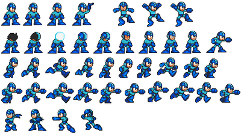

# Mega Man

In my first ever computer science class we were tasked with creating a game that would consist of the HTML, CSS, and Javascript elements that we've learned throughout the year. Prior to this experience our most difficult task at the time was to create a website that had a variety of links to pages that we write about our favorite things. So for this project I decided to find any basic 8bit pixel of a character and program it to navigate through a variety of different platforms: moving or stationary, fly around obstacles, and defeat enemies to survive until the next round. In the image above you can see the different action shots of Mega Man that I had to hand edit the pixels, import the images, and animate to simulate the variety of abilities he would do such as: shooting pellets, jumping, running, climbing, and standing still. 

I was responsible for 100% of the work for this project, and this consisted of: capturing the images, creating the backgrounds, platforms, enemies, projectiles, etc. A few game-like features I decided to add was a "Save and Load" option where the user would be able to pick up right where they left off as well as a life system dependant on 5 hearts. Each time the character is hit by an enemy or falls off of a platform, a heart is deleted. Once the user runs out of hearts it is game over, and they must start over from the beginning. This is the project that made me consider game development as a serious career path, because it forced me into thinking like a developer and ask questions to myself in the perspective of the player in a way that would make their experience fun and challenging. Through this I was able to gain an understanding of all the different moving parts that goes into a video game such as: visuals, sounds, movement physics, controls, and many more. So even though it was a lot of work I am grateful for the experience and the A in the class.
