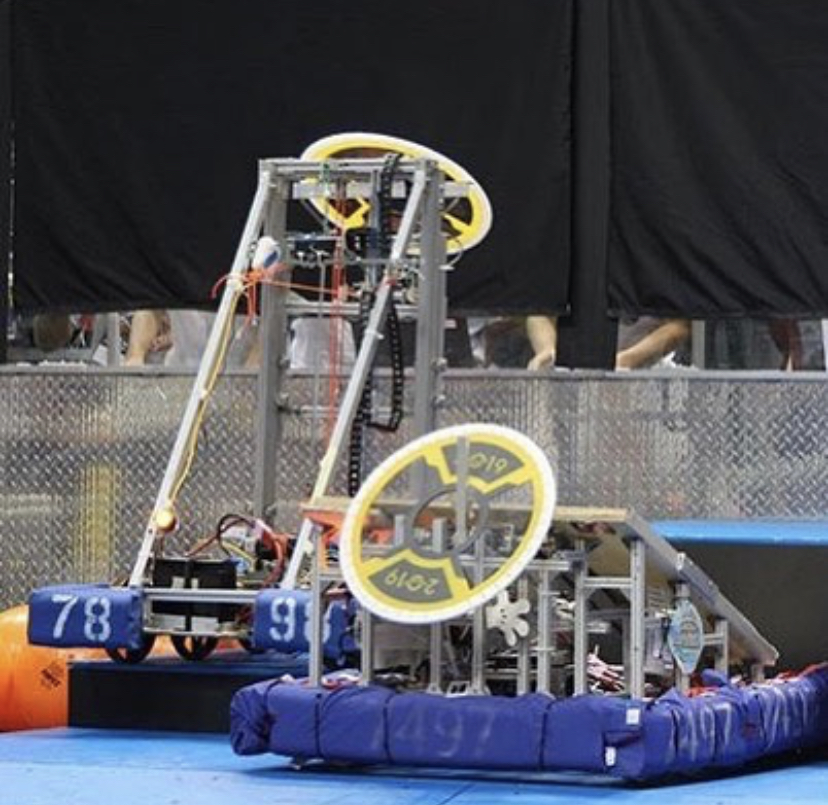

For the 3 years that I participated in my high school robotics team, we were constatly working and perfecting our robot and our understanding of the game mechanics. The team was separated into two subgroups, the builders and the programers. And on the programming team we costantly had to collaborate with our building team in order to make our robot work in sync from hardware to software. This was the first exposure I had to any kind of programming, so I definitely was able to take away a lot of skills that made me later sign up for computer science and engineering classes. The two primary languages we worked with were Robotics C and Java. So as programmers we had to ensure our code did a couple of things: 1. not break the robot, and 2. work as expected.

The most challenging part of this experience was programming was is called autonomous. In ay competition whether it was VEX or FRC, there was always a portion of the match where the robots maneuvered strictly to our pre-programmed movements. This was very difficult because as programmers we had to determine which was the best method for moving the robot and performing the game tasks. For example, if I wanted to program the robot to move 3 feet and then turn 90 degrees, and then move another 3 feet. This actually takes up a lot of lines of code and precision. We had to determine if we wanted to move the wheels according to the time it takes to move 3 feet or the number of revolutions the wheel takes or the degrees the wheel turns in a direction until it was 3 feet. This experiece taught me how to optimize the solutions that would work best for the team, as well as my communication skills with my fellow team members.

By the end of my high school career I had worked my way up to lead programmer, which was an important role because I was then responsible for teaching the younger members of the team how to program and work with their builders since I would be graduating and not there to do it the following year. I made it a log way from not knowing any programming to having people rely on me to help them with their code. 
